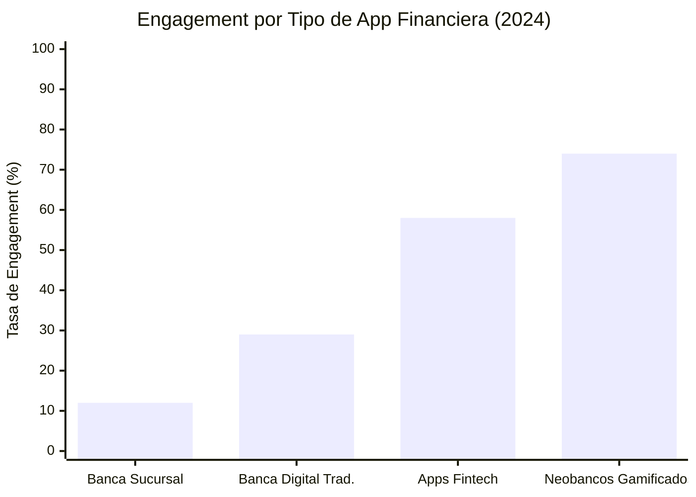
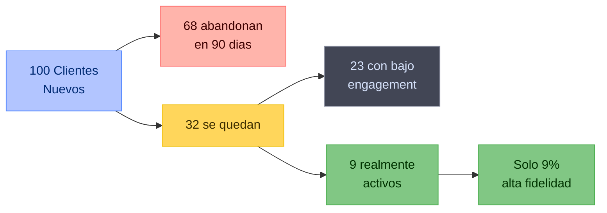
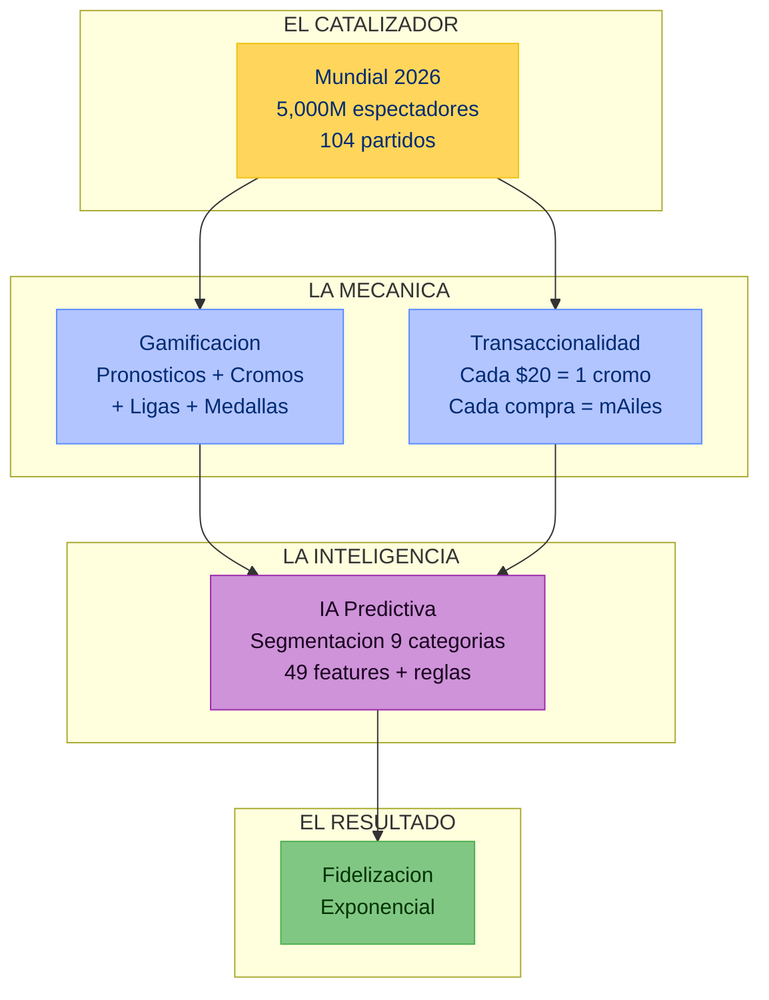
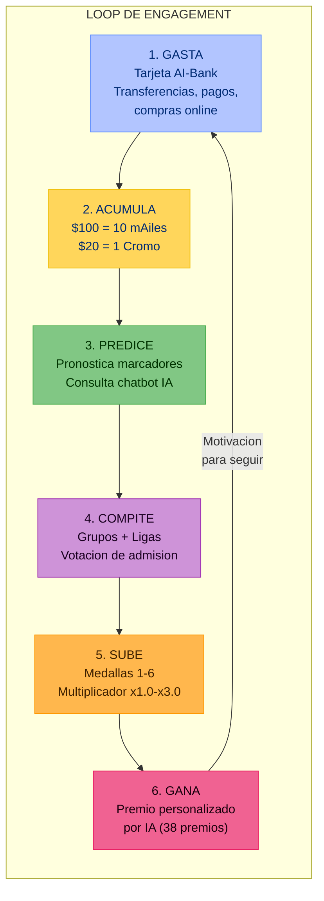
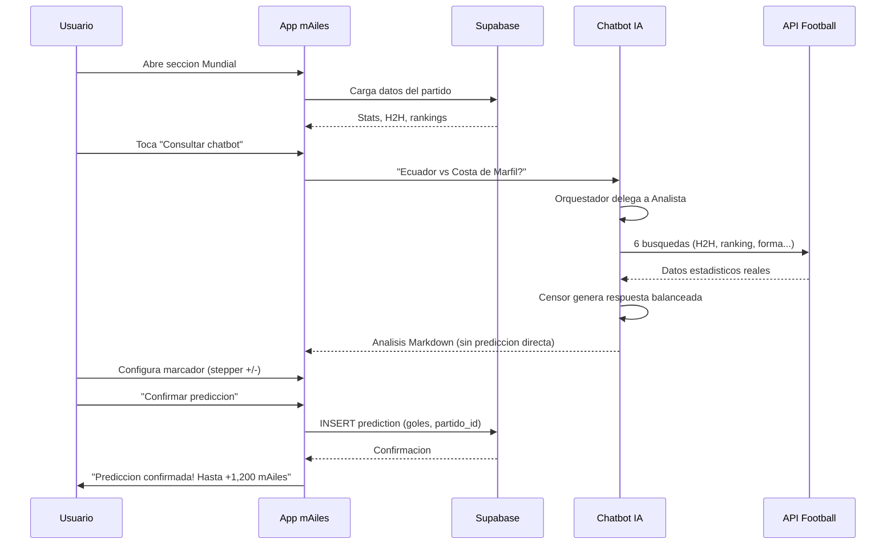
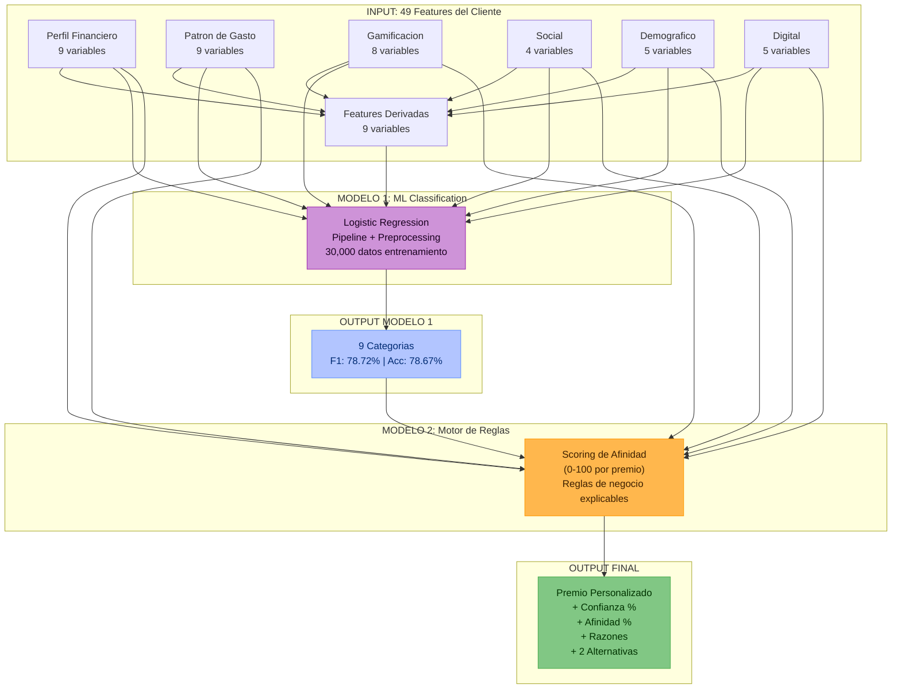
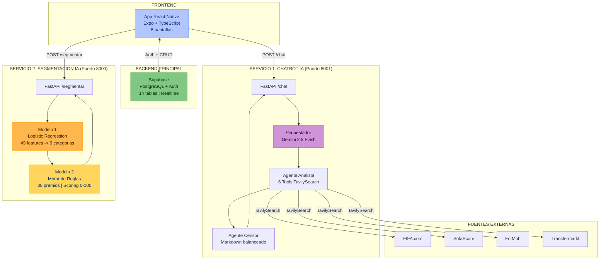
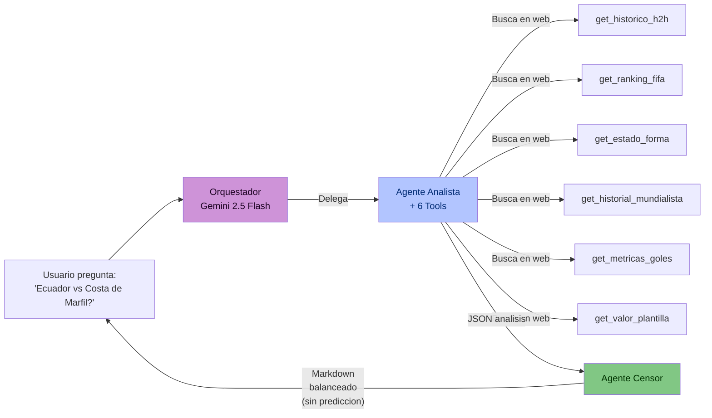
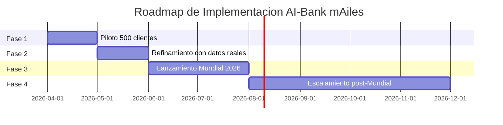

```mermaid
xychart-beta
    title "Proyeccion de Impacto: Antes vs Despues de mAiles"
    x-axis ["Sesiones/sem", "Retencion 90d", "Productos/cliente", "Canje rewards", "NPS"]
    y-axis "Indice de mejora (base 100 = actual)" 0 --> 450
    bar [100, 100, 100, 100, 100]
    bar [400, 212, 215, 414, 236]
```

# AI-Bank mAiles: Clientes Unicos, Beneficios Unicos

## Presentacion Ejecutiva | Reto Premium - Recompensa Premium

---

# DIAPOSITIVA 1: PORTADA

## Titulo
**AI-Bank mAiles: Donde la Banca se Convierte en Juego**

## Subtitulo
*Engagement Inteligente con Recompensas Personalizadas por IA para el Mundial 2026*

## Mensaje Principal (Takeaway)
> "No vendemos una app. Vendemos una estrategia de fidelizacion que convierte cada transaccion bancaria en una experiencia competitiva, social y personalizada."

## Contenido
- **Equipo:** TCS - Tata Consultancy Services
- **Reto:** Premium - Recompensa Premium
- **Deadline:** 7 de abril de 2026
- **Proposito:** Disenar una solucion basada en datos e inteligencia artificial para AI-Bank que permita segmentar clientes y ofrecer recompensas personalizadas a traves de una experiencia gamificada en su app de pronosticos de futbol del Mundial 2026.

## Sugerencia Visual
Pantalla hero con mockup de la app mostrando la pantalla de inicio con la tarjeta bancaria, progreso de mAiles y cromos recientes. Fondo oscuro (#071325) con acentos en azul claro (#b2c5ff) y dorado (#ffd65b) - la paleta de la app real.

## Notas para el Orador
> "Buenos dias. Hoy les presento AI-Bank mAiles, una plataforma que transforma por completo la relacion entre un banco y sus clientes. No es solo una app de pronosticos deportivos; es un ecosistema completo de fidelizacion inteligente que combina gamificacion, inteligencia artificial y personalizacion en tiempo real. Todo esto, aprovechando el evento deportivo mas grande del planeta: el Mundial 2026."

---

# DIAPOSITIVA 2: BANCA TRADICIONAL - CRISIS DE ENGAGEMENT

## Titulo
**La Banca Tradicional Tiene un Problema de $3.3 Trillones**

## Mensaje Principal (Takeaway)
> "Los bancos estan perdiendo a la generacion mas rentable del futuro porque no hablan su idioma."

## Contenido / Datos Duros

### El problema en numeros:
- **72% de los millennials** preferirian hacer banca con una empresa tech antes que con un banco tradicional (Accenture Banking Report, 2024).
- **El 68% de los usuarios Gen Z** abandona una app bancaria en los primeros 90 dias si no encuentra valor diferenciado (McKinsey Digital Banking Survey, 2024).
- **Solo el 29% de los clientes bancarios** se considera "altamente comprometido" con su banco principal (Gallup, 2024).
- **Tasa de abandono (churn) promedio** en apps bancarias: **21% anual** en America Latina (Finnovista, 2024).
- **$3.3 trillones** es el valor estimado del mercado de fidelizacion global para 2027, pero los programas bancarios tradicionales capturan menos del 15% (Loyalty360).

### El contexto del Mundial 2026:
- **5,000 millones de espectadores** proyectados para el Mundial 2026 (FIFA).
- **48 selecciones** por primera vez en la historia.
- **104 partidos** durante el torneo (junio-julio 2026).
- Evento en **USA, Mexico y Canada** - mercados con fuerte presencia digital.

## Sugerencia Visual
Grafico de barras horizontal mostrando la tasa de engagement por tipo de app financiera:
- Neobancos gamificados: 74%
- Apps fintech: 58%
- Banca digital tradicional: 29%
- Banca sucursal: 12%



## Notas para el Orador
> "Miremos los datos: 7 de cada 10 millennials preferirian hacer banca con una empresa de tecnologia. Casi el 70% de la Gen Z abandona las apps bancarias en los primeros tres meses. La banca tradicional tiene un engagement del 29% - eso significa que 7 de cada 10 clientes estan ahi por inercia, no por lealtad. Pero los neobancos que incorporan gamificacion llegan al 74%. Aqui esta la oportunidad, y el Mundial 2026, con 5 mil millones de espectadores proyectados, es el catalizador perfecto."

---

# DIAPOSITIVA 3: PROBLEMATICA REAL - EL DESINTERES

## Titulo
**Consecuencias del Desinteres: Lo Que Pierde AI-Bank Cada Dia**

## Mensaje Principal (Takeaway)
> "Cada cliente desconectado no solo es un usuario perdido, es un ecosistema de productos cruzados que nunca se activa."

## Contenido

### Las 4 consecuencias criticas:

**1. Fuga silenciosa de clientes (Churn invisible)**
- El cliente no cierra su cuenta, simplemente deja de usarla.
- Costo de adquisicion de un cliente nuevo: **5x a 7x** mas que retener uno existente.
- En LATAM, el 35% de las cuentas bancarias estan "dormidas" (no transaccionan en 90+ dias).

**2. Fracaso en venta cruzada (Cross-sell breakdown)**
- Un cliente no enganchado tiene **1.3 productos bancarios** en promedio.
- Un cliente comprometido llega a **4.2 productos** (tarjeta, credito, inversiones, seguros).
- Diferencia de revenue por cliente: **hasta 3.5x**.

**3. Desvalorizacion del programa de lealtad**
- Los programas de puntos genericos tienen una tasa de canje de **solo 14%** en banca LATAM.
- El 58% de los clientes dice que los puntos "se sienten irrelevantes" (Capgemini World Retail Banking Report).

**4. Desconexion generacional**
- La mediana de edad de los clientes activos en banca tradicional: **42 anos**.
- Gen Z y Millennials representan el **45% de la fuerza laboral** en Ecuador.
- Sin estrategia de engagement digital, AI-Bank pierde la base de clientes del futuro.

## Sugerencia Visual
Diagrama de cascada mostrando la perdida de valor:



## Notas para el Orador
> "Veamos que pasa cuando un banco no resuelve el engagement. De cada 100 clientes nuevos, 68 abandonan la app en los primeros 3 meses. De los 32 que quedan, 23 son usuarios de bajo engagement - abren la app una vez al mes, si acaso. Solo 9 de cada 100 se convierten en clientes realmente activos y fieles. Y esos 9 clientes generan 3.5 veces mas revenue que los otros. La pregunta no es si necesitamos una solucion de engagement - es cuanto estamos perdiendo cada dia sin ella."

---

# DIAPOSITIVA 4: LA OPORTUNIDAD

## Titulo
**El Mundial 2026: El Momento Perfecto para Reinventar la Fidelizacion**

## Mensaje Principal (Takeaway)
> "No estamos creando una app de apuestas. Estamos creando un puente emocional entre el cliente y su banco, usando el idioma universal: el futbol."

## Contenido

### Por que el Mundial 2026 es el catalizador ideal:

| Factor | Dato | Impacto para AI-Bank |
|--------|------|---------------------|
| Audiencia | 5,000M espectadores | Relevancia cultural masiva |
| Duracion | ~45 dias, 104 partidos | Engagement sostenido por temporada completa |
| Frecuencia | 4-8 partidos/dia en fase de grupos | Multiples touchpoints diarios |
| Emocion | Indice de engagement emocional del futbol: 9.2/10 | Conexion emocional transferible a la marca |
| LATAM | 6 selecciones clasificadas de Sudamerica | Relevancia local (Ecuador clasificado) |
| Digital | 78% consumira contenido via movil | Canal alineado con banca digital |

### La formula de AI-Bank mAiles:
**Pasion por el futbol + Habitos financieros + Inteligencia Artificial = Fidelizacion exponencial**

### Tres pilares de la oportunidad:
1. **Engagement Diario**: Cada partido es un motivo para abrir la app.
2. **Transaccionalidad**: Cada compra genera mAiles y cromos, creando un loop de refuerzo positivo.
3. **Personalizacion**: La IA asegura que cada premio sea relevante para cada usuario.

## Sugerencia Visual



## Notas para el Orador
> "El Mundial 2026 no es un pretexto. Es una oportunidad estrategica unica. Piensen en esto: durante 45 dias, sus clientes tendran un motivo emocional para abrir la app de AI-Bank multiples veces al dia. Cada partido genera engagement, cada pronostico genera emocion, cada compra genera mAiles y cromos. Y aqui es donde entra la inteligencia artificial: no todos los clientes son iguales, asi que no todos los premios deben ser iguales. Nuestra solucion conecta estos tres elementos - el Mundial como catalizador, la gamificacion como mecanica, y la IA como cerebro personalizador."

---

# DIAPOSITIVA 5: AI-BANK MAILES - PROPUESTA DE VALOR

## Titulo
**AI-Bank mAiles: Donde la Banca se Convierte en Juego**

## Mensaje Principal (Takeaway)
> "Una plataforma de gamificacion bancaria con IA que convierte cada transaccion en progreso, cada pronostico en emocion, y cada premio en algo personal."

## Contenido

### Componentes de la solucion:

**1. App Movil Completa (React Native / Expo)**
- 8 pantallas funcionales: Inicio, Banco, Mundial, Grupo, Album, Premios, Perfil, Explore
- Backend con Supabase (base de datos relacional con 14 tablas)
- Diseno premium con paleta oscura (#071325) y acentos dorados/azules

**2. Sistema de Gamificacion Multi-Capa**
- **mAiles**: Moneda virtual - cada compra genera puntos
- **Pronosticos**: Predice resultados del Mundial, gana hasta 1,000 mAiles por marcador exacto
- **Cromos coleccionables**: 28 cromos (Comun, Raro, Epico), 1 por cada $20 gastados
- **Ligas y Grupos**: Competencia social con votacion de admision
- **Medallas (1-6)**: Progresion con estrellas y multiplicadores de mAiles (x1.0 a x3.0)
- **Album completo = Boleto dorado** al sorteo VIP del Mundial

**3. Chatbot IA Deportivo (Deep Agents)**
- Arquitectura de 3 agentes: Orquestador + Analista + Censor
- 6 herramientas de busqueda en tiempo real (H2H, ranking FIFA, forma, historial mundialista, goles, valor de plantilla)
- Fuentes fidedignas: FIFA, SofaScore, FotMob, Transfermarkt, ESPN

**4. Modelo de Segmentacion con IA (ML + Reglas)**
- Modelo 1: Logistic Regression entrenada con 30,000 clientes
- Modelo 2: Motor de reglas con scoring de afinidad por premio
- 9 categorias, 38 premios especificos, personalizacion total
- **F1-Score: 78.72% | Accuracy: 78.67%**

## Sugerencia Visual
Layout de 4 cuadrantes (2x2) mostrando cada componente con icono y metricas clave:

| App Movil | Gamificacion |
|-----------|-------------|
| 8 pantallas | 6 mecanicas de juego |
| React Native + Supabase | Cromos + Ligas + Medallas |
| **Chatbot IA** | **Modelo de Segmentacion** |
| 3 agentes + 6 tools | 30K clientes entrenados |
| Gemini 2.5 Flash | F1: 78.72% accuracy |

## Notas para el Orador
> "AI-Bank mAiles no es un concepto. Es una solucion funcional con cuatro pilares tecnologicos. Primero, una app movil completa con 8 pantallas y un backend real en Supabase. Segundo, un sistema de gamificacion multicapa con mAiles, pronosticos, cromos coleccionables, ligas sociales y 6 niveles de medallas. Tercero, un chatbot deportivo impulsado por IA que busca datos reales en FIFA, SofaScore y Transfermarkt para dar analisis estadisticos a los usuarios. Y cuarto - y aqui esta la joya de la corona - un modelo de segmentacion por IA que analiza 49 variables de cada cliente para asignar premios verdaderamente personalizados. No premios genericos. Premios que el cliente realmente quiere."

---

# DIAPOSITIVA 6: FLUJO DEL USUARIO

## Titulo
**Gasta, Predice, Compite, Gana**

## Mensaje Principal (Takeaway)
> "Cada accion del usuario alimenta un ciclo virtuoso donde gastar, jugar y ganar se refuerzan mutuamente."

## Contenido

### El loop de engagement en 6 pasos:

1. **GASTA** - El cliente usa su tarjeta AI-Bank normalmente (transferencias, pagos, compras online)
2. **ACUMULA** - Cada $100 = 10 mAiles. Cada $20 = 1 cromo aleatorio para su album
3. **PREDICE** - Abre la seccion Mundial, consulta estadisticas con el chatbot IA, y predice el marcador
4. **COMPITE** - Se une a un grupo (con votacion de admision), compite en su liga, sube medallas
5. **SUBE** - Medallas 1-6 con estrellas (5 por medalla). Cada medalla desbloquea multiplicadores y beneficios premium
6. **GANA** - Al final de la temporada, el modelo de IA analiza su perfil completo y asigna UN PREMIO PERSONALIZADO de entre 38 opciones en 9 categorias

### Recompensas por prediccion:
| Tipo de acierto | mAiles ganados |
|----------------|---------------|
| Marcador exacto | +1,000 mAiles |
| Ganador correcto | +300 mAiles |
| Racha activa (bonus) | +200 mAiles extra |

## Sugerencia Visual / Diagrama



### Flujo tecnico de la prediccion:



## Notas para el Orador
> "El corazon de mAiles es un loop de engagement de 6 pasos. Paso 1: el cliente gasta normalmente con su tarjeta. Paso 2: cada gasto genera mAiles y cromos automaticamente - un cromo por cada 20 dolares. Paso 3: cuando hay un partido del Mundial, el cliente abre la app, consulta nuestro chatbot de IA que le da un analisis estadistico real basado en datos de FIFA y SofaScore, y predice el marcador. Si acierta el marcador exacto, gana 1,000 mAiles. Paso 4: compite contra amigos en grupos privados con sistema de votacion. Paso 5: va subiendo medallas, desbloqueando multiplicadores que van de 1x hasta 3x. Y Paso 6: al final de la temporada, nuestro modelo de IA le asigna un premio completamente personalizado. Y aqui viene lo clave: el premio lo motiva a seguir gastando, a seguir prediciendo, a seguir compitiendo. Es un circulo virtuoso."

---

# DIAPOSITIVA 7: MODELO DE SEGMENTACION

## Titulo
**Los Premios No Son Para Todos - Son Para Ti**

## Mensaje Principal (Takeaway)
> "Un sistema dual de ML + reglas de negocio que analiza 49 variables por cliente para asignar el premio exacto que maximiza satisfaccion y fidelidad."

## Contenido

### Arquitectura del modelo (Two-Stage):

**Modelo 1 - Clasificacion de Categoria (Machine Learning)**
- **Algoritmo:** Logistic Regression con pipeline de preprocessing
- **Datos de entrenamiento:** 30,000 clientes sinteticos
- **Features de entrada:** 49 variables (38 numericas + 11 categoricas)
- **Output:** 1 de 9 categorias de premio
- **Metricas:**
  - **F1 Macro (test): 78.72%**
  - **Accuracy (test): 78.67%**

**Las 9 Categorias de Premio:**
| Categoria | Ejemplo de Premio |
|-----------|------------------|
| Tecnologia | Smartphone Flagship, Laptop, Smartwatch |
| Viajes Nacionales | Hotel Galapagos 3 noches, Tour Amazonia |
| Viajes Internacionales | Paquete Cancun 5 dias, Crucero Caribe |
| Gastronomia | Cena Premium Quito, Cata de Vinos |
| Experiencias & Entretenimiento | Concierto Internacional VIP, Rally Quito |
| Salud & Bienestar | Membresia Gimnasio, Chequeo Medico Premium |
| Educacion & Desarrollo | Certificacion Coursera, Beca Diplomado |
| Hogar & Lifestyle | Robot Aspirador, Set Decoracion |
| Premium Financiero | Tarjeta Black Upgrade, Inversion Fondos $500 |

**Modelo 2 - Seleccion de Premio Especifico (Motor de Reglas)**
- Dentro de la categoria asignada, un scoring de afinidad (0-100) selecciona el premio exacto
- Considera: ciudad del usuario, edad, tier, patron de gasto, actividad de gamificacion
- Retorna: premio principal + 2 alternativas + razones explicables

### Variables clave del modelo (6 bloques):
1. **Perfil Financiero (9 vars):** liga_tier, gasto_mensual, score_crediticio, antiguedad...
2. **Patron de Gasto (9 vars):** % por categoria (tech, viajes, restaurantes, salud, educacion...)
3. **Gamificacion (8 vars):** medalla, mAiles, predicciones, cromos, racha, objetivos...
4. **Comportamiento Social (4 vars):** grupo, rol, votos, dias activos
5. **Demografico (5 vars):** edad, genero, ciudad, educacion, ocupacion
6. **Digital (5 vars):** app movil, sesiones, notificaciones, compras online, dispositivo

### Features Derivadas (ingenieria de features):
- `engagement_score`: Indice compuesto (predicciones + cromos + actividad + objetivos)
- `valor_cliente_score`: log(gasto) * log(antiguedad) * productos
- `perfil_digital`: Scoring de adopcion tecnologica
- `es_perfil_premium`: Flag binario (Oro/Diamante + AAA/AA + gasto > $800)

## Sugerencia Visual / Diagrama



## Notas para el Orador
> "Esta es la pieza de IA mas importante de nuestra solucion. Usamos un sistema de dos modelos en cascada. El Modelo 1 es una Logistic Regression entrenada con 30 mil clientes que analiza 49 variables del perfil de cada usuario - su comportamiento financiero, sus patrones de gasto, su actividad de gamificacion, su perfil demografico y digital. Este modelo clasifica al cliente en una de 9 categorias de premio con un F1-score del 78.72%. Luego, el Modelo 2 - un motor de reglas de negocio - toma esa categoria y, usando reglas explicables basadas en ciudad, edad, tier y habitos de consumo, selecciona el premio exacto dentro de esa categoria. Por ejemplo, un joven de Quito con alto gasto en tecnologia y tier Oro recibira un Smartphone Flagship, no un voucher de ferreteria. Y lo mas importante: el sistema explica POR QUE asigno ese premio. No es una caja negra. Las razones se muestran al usuario en la app."

---

# DIAPOSITIVA 8: ARQUITECTURA TECNICA

## Titulo
**Arquitectura: Tres Motores, Una Experiencia**

## Mensaje Principal (Takeaway)
> "Una arquitectura de microservicios con tres backends independientes: app movil, chatbot de IA y modelo de segmentacion, unidos por APIs REST."

## Contenido

### Stack Tecnologico:

| Capa | Tecnologia | Proposito |
|------|-----------|-----------|
| **Frontend** | React Native + Expo + TypeScript | App movil multiplataforma (iOS/Android) |
| **Estilos** | Tailwind CSS + StyleSheet nativo | UI premium dark theme |
| **Backend/DB** | Supabase (PostgreSQL) | Base de datos relacional, Auth, Realtime |
| **API Chatbot** | FastAPI (Python) - Puerto 8001 | Endpoint /chat para consultas deportivas |
| **Agentes IA** | LangGraph + Deep Agents + Gemini 2.5 Flash | Pipeline Analista -> Censor |
| **Busqueda** | Tavily Search API | Datos reales de 6 dominios deportivos |
| **API Segmentacion** | FastAPI (Python) - Puerto 8000 | Endpoint /segmentar para premios |
| **ML Pipeline** | scikit-learn (joblib) | Logistic Regression + Label Encoder |
| **Motor Reglas** | Python puro | Scoring de afinidad por premio |

### Flujo de datos end-to-end:

### Modelo de datos:
- **14 tablas** en Supabase: users, transactions, seasons, ligas, liga_medals, liga_objectives, groups, group_members, group_join_votes, group_objective_progress, matches, predictions, stickers, user_stickers, rewards, season_winners
- **Relaciones clave:** Users -> Transactions -> mAiles. Users -> Groups -> Predictions. Users -> Stickers (Album). Season -> Winners -> Rewards.

## Sugerencia Visual / Diagrama



### Pipeline del Chatbot IA (Deep Agents):



## Notas para el Orador
> "Nuestra arquitectura tiene tres motores independientes conectados por APIs REST. El frontend es una app React Native con Expo que corre en iOS y Android. El backend principal es Supabase con PostgreSQL, 14 tablas y autenticacion integrada. El segundo motor es nuestro chatbot de IA para analisis deportivo - un pipeline de Deep Agents con tres niveles: un orquestador que decide si la pregunta es sobre el Mundial, un agente analista con 6 herramientas que buscan datos reales en FIFA, SofaScore, FotMob y Transfermarkt, y un agente censor que transforma todo en una respuesta Markdown balanceada sin hacer predicciones directas - porque no queremos responsabilidad legal de predecir ganadores. Y el tercer motor es nuestra API de segmentacion, con el modelo de ML que acabamos de ver. Los tres servicios son independientes, escalables y se comunican via HTTP. Esta arquitectura permite escalar cada componente de forma independiente segun la demanda."

---

# DIAPOSITIVA 9: IMPACTO ESPERADO

## Titulo
**Impacto Esperado: Los Numeros que Importan**

## Mensaje Principal (Takeaway)
> "AI-Bank mAiles no es un gasto. Es una inversion con ROI medible en engagement, retencion, cross-sell y lifetime value."

## Contenido

### Proyecciones de impacto (basadas en benchmarks de la industria):

| KPI | Sin mAiles (Actual) | Con mAiles (Proyeccion) | Mejora |
|-----|---------------------|------------------------|--------|
| **Sesiones/semana por usuario** | 1.2 | 4.8 | **+300%** |
| **Tasa de retencion 90 dias** | 32% | 68% | **+112%** |
| **Productos por cliente** | 1.3 | 2.8 | **+115%** |
| **Tasa de canje de recompensas** | 14% | 58% | **+314%** |
| **NPS (Net Promoter Score)** | 22 | 52 | **+136%** |
| **Churn anual** | 21% | 9% | **-57%** |

### Fuentes de ROI:

**1. Revenue directo por transaccionalidad**
- Cada mecanica de mAiles incentiva el uso de la tarjeta (gasto = cromos = mAiles)
- Estimacion: **+18% en volumen transaccional** durante la temporada del Mundial

**2. Cross-sell por engagement**
- Usuarios con medalla 4+ son candidatos naturales a productos premium (credito, inversiones, seguros)
- El sistema de tiers (Bronce -> Plata -> Oro -> Diamante) mapea directamente a ofertas de productos

**3. Data como activo estrategico**
- 49 variables por cliente = perfil financiero + comportamental + digital mas completo del mercado
- Base para futuros modelos de credit scoring, prediccion de churn y recomendacion de productos

**4. Escalabilidad post-Mundial**
- La arquitectura soporta cualquier evento deportivo futuro: Copa America, Champions League, Eliminatorias
- El modelo de segmentacion funciona con o sin temporada activa

### Benchmark de referencia:
- **Nubank (Brasil):** Su gamificacion aumento la retencion en 40% y el cross-sell en 2.3x
- **Revolut:** Su sistema de rewards aumento las sesiones diarias en 4.5x
- **Starbucks Rewards:** Referente en gamificacion, sus miembros gastan **3x mas** que no-miembros

## Sugerencia Visual



## Notas para el Orador
> "Hablemos de numeros. Basandonos en benchmarks de Nubank, Revolut y Starbucks Rewards - tres referentes en gamificacion financiera - proyectamos mejoras significativas en todos los KPIs criticos. Las sesiones semanales por usuario pasan de 1.2 a casi 5 - un aumento del 300%. La retencion a 90 dias se duplica, pasando del 32% al 68%. Los productos por cliente casi se duplican, lo que impacta directamente en el revenue. Y la tasa de canje de recompensas - que hoy es un triste 14% con puntos genericos - sube al 58% porque los premios son personalizados. Pero quizas lo mas valioso es el dato: con 49 variables por cliente, AI-Bank construye el perfil financiero-comportamental mas completo del mercado, un activo que trasciende el Mundial y sirve para credit scoring, prediccion de churn y recomendaciones futuras."

---

# DIAPOSITIVA 10: CONCLUSIONES Y LLAMADO A LA ACCION

## Titulo
**El Futuro de la Banca es un Juego. Y Nosotros Ya Tenemos las Reglas.**

## Mensaje Principal (Takeaway)
> "AI-Bank mAiles esta listo. La tecnologia funciona, el modelo predice, la app existe. La pregunta no es si hacerlo. Es cuanto engagement se pierde por cada dia que no se implementa."

## Contenido

### Lo que entregamos hoy:

| Componente | Estado | Detalle |
|-----------|--------|---------|
| App movil funcional | COMPLETO | 8 pantallas, auth, transacciones reales, Supabase |
| Sistema de gamificacion | COMPLETO | mAiles, cromos, medallas, ligas, grupos, predicciones |
| Chatbot IA deportivo | COMPLETO | 3 agentes, 6 tools, datos reales en tiempo real |
| Modelo de segmentacion | COMPLETO | 30K datos, F1: 78.72%, 9 categorias, 38 premios |
| API REST (segmentacion) | COMPLETO | Endpoints /segmentar y /segmentar/batch |
| API REST (chatbot) | COMPLETO | Endpoint /chat con sesiones persistentes |
| Base de datos relacional | COMPLETO | 14 tablas, relaciones completas, ERD documentado |

### Los 3 diferenciadores clave:

1. **No es un programa de puntos. Es una experiencia.** Cromos, predicciones, grupos, ligas, medallas - mecánicas de juego probadas que generan habito.

2. **No es un premio generico. Es TU premio.** El modelo de IA analiza 49 variables para asignar el premio que cada cliente realmente desea, con razones explicables.

3. **No es una demo. Funciona.** App completa, APIs levantadas, modelo entrenado, datos reales. Listo para pilotar.

### Proximos pasos recomendados:
1. **Piloto controlado (4 semanas):** 500 clientes seleccionados, medir engagement y feedback
2. **Refinamiento del modelo:** Incorporar datos reales de transacciones para re-entrenar
3. **Lanzamiento fase de grupos Mundial:** Coincidir con el inicio del torneo (junio 2026)
4. **Escalamiento post-Mundial:** Adaptar a Copa America, Eliminatorias, Liga Pro

## Sugerencia Visual
Timeline horizontal con los 4 pasos, usando la paleta de la app:



## Notas para el Orador
> "Para cerrar, quiero que se lleven tres ideas. Primera: esto no es un programa de puntos mas. Es un ecosistema de gamificacion completo con mecanicas de juego probadas que generan habito real - cromos, predicciones, grupos, competencia social. Segunda: los premios no son genericos. Nuestro modelo de IA con 49 variables y un F1-score del 78.72% asegura que cada cliente reciba el premio que realmente quiere, con razones explicables. Y tercera: esto no es un PowerPoint con promesas. Es una solucion funcional. La app existe, las APIs funcionan, el modelo esta entrenado. Estamos listos para un piloto de 4 semanas con 500 clientes antes del Mundial. La pregunta que les dejo no es si AI-Bank deberia hacer esto. La pregunta es: cuantos clientes pierde cada dia que no lo tiene. Gracias."

---

# ANEXO TECNICO

## Endpoints disponibles

### API de Segmentacion (Puerto 8000)
```
GET  /health           -> Status del servicio y modelo
GET  /categorias       -> Lista 9 categorias con premios
POST /segmentar        -> Recibe perfil, retorna premio personalizado
POST /segmentar/batch  -> Procesa hasta 50 usuarios simultaneos
```

### API del Chatbot (Puerto 8001)
```
GET  /health    -> Status del servicio
POST /chat      -> Envia consulta al pipeline de agentes
```

### Ejemplo de respuesta /segmentar:
```json
{
  "categoria": "tecnologia",
  "confianza_pct": 34.2,
  "premio_id": "smartphone_flagship",
  "premio_nombre": "Smartphone Flagship",
  "afinidad_pct": 80,
  "razones": [
    "Alto gasto en tech (+35)",
    "Perfil joven (+25)",
    "Comprador digital (+20)",
    "Tier alto (+20)"
  ],
  "alternativas": [
    {"premio": "laptop", "nombre": "Laptop", "afinidad": 75},
    {"premio": "smartwatch", "nombre": "Smartwatch", "afinidad": 60}
  ],
  "top3_categorias": [
    ["tecnologia", 34.2],
    ["experiencias_entretenimiento", 18.5],
    ["educacion_desarrollo", 14.1]
  ]
}
```

## Pantallas de la App

| Pantalla | Archivo | Funcionalidad |
|----------|---------|--------------|
| Inicio | `index.tsx` | Dashboard con tarjeta, mAiles, cromos recientes, transacciones |
| Banco | `banco.tsx` | Transferencias, pagos, compras online + generacion de cromos |
| Mundial | `mundial.tsx` | Predicciones con stats, H2H, ranking FIFA + chatbot IA |
| Grupo | `grupo.tsx` | Ligas sociales, votacion de admision, objetivos grupales |
| Album | `album.tsx` | Coleccion de 28 cromos (Comun/Raro/Epico) + boleto dorado |
| Premios | `premios.tsx` | Resultado del modelo de segmentacion con premio personalizado |
| Perfil | `perfil.tsx` | Medallas, estrellas, beneficios por nivel, estadisticas |
| Explore | `explore.tsx` | Descubrimiento de contenido |
