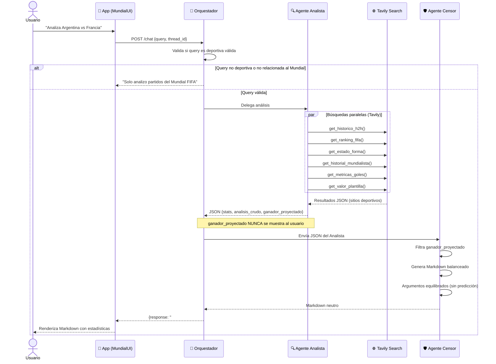

```mermaid
sequenceDiagram
    actor User as Usuario
    participant App as 📱 App (MundialUI)
    participant Orch as 🤖 Orquestador
    participant Anal as 🔍 Agente Analista
    participant Tavily as 🌐 Tavily Search
    participant Cens as 🛡️ Agente Censor

    User->>App: "Analiza Argentina vs Francia"
    App->>Orch: POST /chat {query, thread_id}

    Orch->>Orch: Valida si query es deportiva válida
    alt Query no deportiva o no relacionada al Mundial
        Orch-->>App: "Solo analizo partidos del Mundial FIFA"
    else Query válida
        Orch->>Anal: Delega análisis

        par Búsquedas paralelas (Tavily)
            Anal->>Tavily: get_historico_h2h()
            Anal->>Tavily: get_ranking_fifa()
            Anal->>Tavily: get_estado_forma()
            Anal->>Tavily: get_historial_mundialista()
            Anal->>Tavily: get_metricas_goles()
            Anal->>Tavily: get_valor_plantilla()
        end

        Tavily-->>Anal: Resultados JSON (sitios deportivos)

        Anal-->>Orch: JSON {stats, analisis_crudo, ganador_proyectado}
        Note over Anal,Orch: ganador_proyectado NUNCA se muestra al usuario

        Orch->>Cens: Envía JSON del Analista

        Cens->>Cens: Filtra ganador_proyectado
        Cens->>Cens: Genera Markdown balanceado
        Cens->>Cens: Argumentos equilibrados (sin predicción)

        Cens-->>Orch: Markdown neutro
        Orch-->>App: {response: "## Análisis...", thread_id}
        App-->>User: Renderiza Markdown con estadísticas
    end
```
