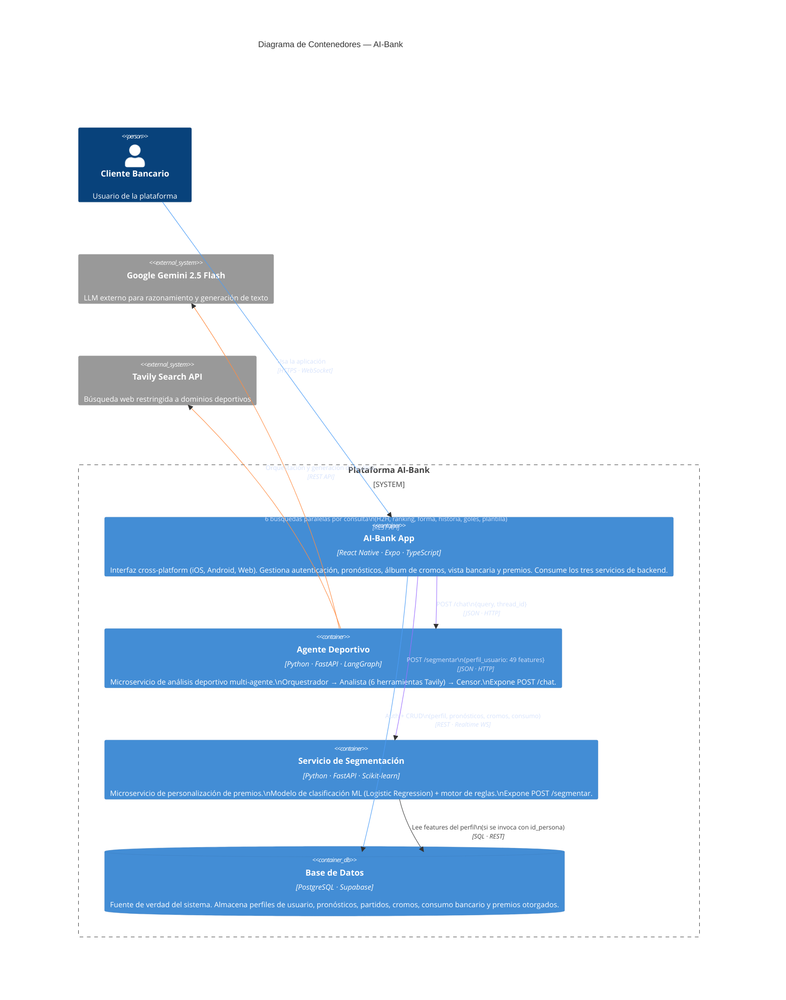

```mermaid
C4Container
    title Diagrama de Contenedores — AI-Bank

    Person(customer, "Cliente Bancario", "Usuario de la plataforma")

    System_Boundary(aibank, "Plataforma AI-Bank") {

        Container(mobile, "AI-Bank App", "React Native · Expo · TypeScript", "Interfaz cross-platform (iOS, Android, Web). Gestiona autenticación, pronósticos, álbum de cromos, vista bancaria y premios. Consume los tres servicios de backend.")

        Container(agent_svc, "Agente Deportivo", "Python · FastAPI · LangGraph", "Microservicio de análisis deportivo multi-agente.\nOrquestrador → Analista (6 herramientas Tavily) → Censor.\nExpone POST /chat.")

        Container(seg_svc, "Servicio de Segmentación", "Python · FastAPI · Scikit-learn", "Microservicio de personalización de premios.\nModelo de clasificación ML (Logistic Regression) + motor de reglas.\nExpone POST /segmentar.")

        ContainerDb(db, "Base de Datos", "PostgreSQL · Supabase", "Fuente de verdad del sistema. Almacena perfiles de usuario, pronósticos, partidos, cromos, consumo bancario y premios otorgados.")
    }

    System_Ext(gemini, "Google Gemini 2.5 Flash", "LLM externo para razonamiento y generación de texto")
    System_Ext(tavily, "Tavily Search API", "Búsqueda web restringida a dominios deportivos")

    Rel(customer, mobile, "Usa la aplicación", "HTTPS · WebSocket")

    Rel(mobile, agent_svc, "POST /chat\n{query, thread_id}", "JSON · HTTP")
    Rel(mobile, seg_svc, "POST /segmentar\n{perfil_usuario: 49 features}", "JSON · HTTP")
    Rel(mobile, db, "Auth + CRUD\n(perfil, pronósticos, cromos, consumo)", "REST · Realtime WS")

    Rel(agent_svc, gemini, "Orquestación y generación de análisis", "REST API")
    Rel(agent_svc, tavily, "6 búsquedas paralelas por consulta\n(H2H, ranking, forma, historia, goles, plantilla)", "REST API")

    Rel(seg_svc, db, "Lee features del perfil\n(si se invoca con id_persona)", "SQL · REST")

    UpdateRelStyle(customer, mobile, $textColor="#d7e3fc", $lineColor="#4d9ef7")
    UpdateRelStyle(mobile, agent_svc, $textColor="#d7e3fc", $lineColor="#9b6fff")
    UpdateRelStyle(mobile, seg_svc, $textColor="#d7e3fc", $lineColor="#9b6fff")
    UpdateRelStyle(mobile, db, $textColor="#d7e3fc", $lineColor="#4d9ef7")
    UpdateRelStyle(agent_svc, gemini, $textColor="#d7e3fc", $lineColor="#ff8c42")
    UpdateRelStyle(agent_svc, tavily, $textColor="#d7e3fc", $lineColor="#ff8c42")
```
