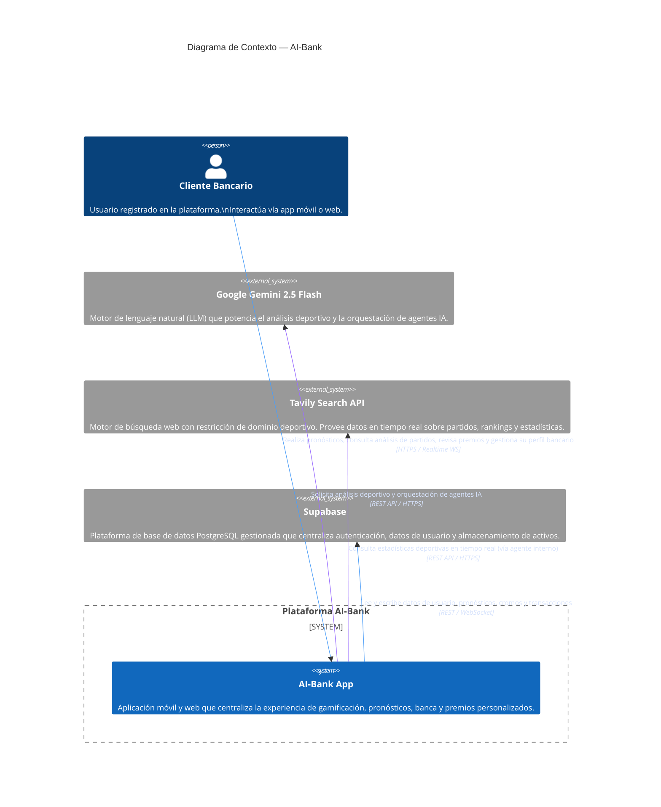

```mermaid
C4Context
    title Diagrama de Contexto — AI-Bank

    Person(customer, "Cliente Bancario", "Usuario registrado en la plataforma.\nInteractúa vía app móvil o web.")

    System_Boundary(aibank, "Plataforma AI-Bank") {
        System(app, "AI-Bank App", "Aplicación móvil y web que centraliza la experiencia de gamificación, pronósticos, banca y premios personalizados.")
    }

    System_Ext(gemini, "Google Gemini 2.5 Flash", "Motor de lenguaje natural (LLM) que potencia el análisis deportivo y la orquestación de agentes IA.")
    System_Ext(tavily, "Tavily Search API", "Motor de búsqueda web con restricción de dominio deportivo. Provee datos en tiempo real sobre partidos, rankings y estadísticas.")
    System_Ext(supabase, "Supabase", "Plataforma de base de datos PostgreSQL gestionada que centraliza autenticación, datos de usuario y almacenamiento de activos.")

    Rel(customer, app, "Realiza pronósticos, consulta análisis de partidos, revisa premios y gestiona su perfil bancario", "HTTPS / Realtime WS")
    Rel(app, gemini, "Solicita análisis deportivo y orquestación de agentes IA", "REST API / HTTPS")
    Rel(app, tavily, "Consulta estadísticas deportivas en tiempo real (vía agente interno)", "REST API / HTTPS")
    Rel(app, supabase, "Lee y escribe datos de usuario, pronósticos, cromos y transacciones", "REST / WebSocket")

    UpdateRelStyle(customer, app, $textColor="#d7e3fc", $lineColor="#4d9ef7")
    UpdateRelStyle(app, gemini, $textColor="#d7e3fc", $lineColor="#9b6fff")
    UpdateRelStyle(app, tavily, $textColor="#d7e3fc", $lineColor="#9b6fff")
    UpdateRelStyle(app, supabase, $textColor="#d7e3fc", $lineColor="#4d9ef7")
```
