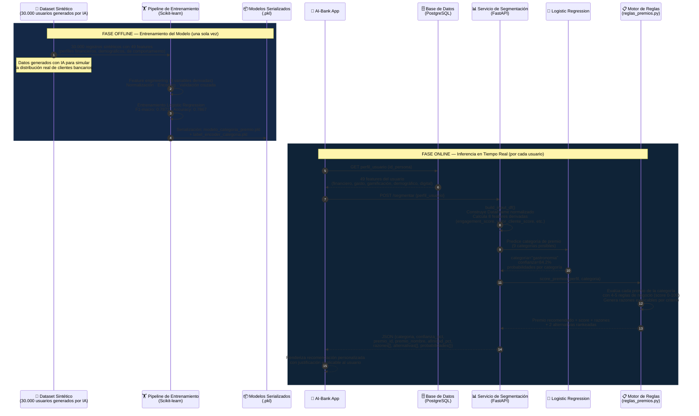

```mermaid
sequenceDiagram
    autonumber
    participant DS as 🧪 Dataset Sintético<br/>(30.000 usuarios generados por IA)
    participant TRAIN as 🏋️ Pipeline de Entrenamiento<br/>(Scikit-learn)
    participant PKL as 📦 Modelos Serializados<br/>(.pkl)
    participant APP as 📱 AI-Bank App
    participant DB as 🗄️ Base de Datos<br/>(PostgreSQL)
    participant SVC as 📊 Servicio de Segmentación<br/>(FastAPI)
    participant ML as 🧠 Logistic Regression
    participant RULES as 📋 Motor de Reglas<br/>(reglas_premios.py)

    rect rgb(20, 40, 70)
        Note over DS,PKL: FASE OFFLINE — Entrenamiento del Modelo (una sola vez)
        DS->>TRAIN: 30.000 registros sintéticos con 49 features<br/>(perfiles financieros, demográficos, de comportamiento)
        Note over DS: Datos generados con IA para simular<br/>la distribución real de clientes bancarios
        TRAIN->>TRAIN: Feature engineering (8 variables derivadas)<br/>Normalización · Encoding · Validación cruzada
        TRAIN->>TRAIN: Entrenamiento Logistic Regression<br/>F1-macro: 0.7872 · Accuracy: 0.7867
        TRAIN->>PKL: Serialización: modelo_categoria_premio.pkl<br/>+ label_encoder_categoria.pkl
    end

    rect rgb(15, 35, 55)
        Note over APP,RULES: FASE ONLINE — Inferencia en Tiempo Real (por cada usuario)
        APP->>DB: GET perfil_usuario (id_persona)
        DB-->>APP: 49 features del usuario<br/>(financiero, gasto, gamificación, demográfico, digital)
        APP->>SVC: POST /segmentar {perfil_usuario}

        SVC->>SVC: build_input_df()<br/>Construye DataFrame normalizado<br/>Calcula 8 features derivadas<br/>(engagement_score, valor_cliente_score, etc.)

        SVC->>ML: Predice categoría de premio<br/>(9 categorías posibles)
        ML-->>SVC: categoria="gastronomia"<br/>confianza=84.2%<br/>probabilidades por categoría

        SVC->>RULES: score_premios(perfil, categoria)
        RULES->>RULES: Evalúa cada premio de la categoría<br/>con 4-5 reglas de negocio (score 0-100)<br/>Genera razones explicables por criterio

        RULES-->>SVC: Premio recomendado + score + razones<br/>+ 2 alternativas rankeadas

        SVC-->>APP: JSON {categoria, confianza_pct,<br/>premio_id, premio_nombre, afinidad_pct,<br/>razones[], alternativas[], probabilidades{}}
        APP-->>APP: Renderiza recomendación personalizada<br/>con justificación explicable al usuario
    end
```
