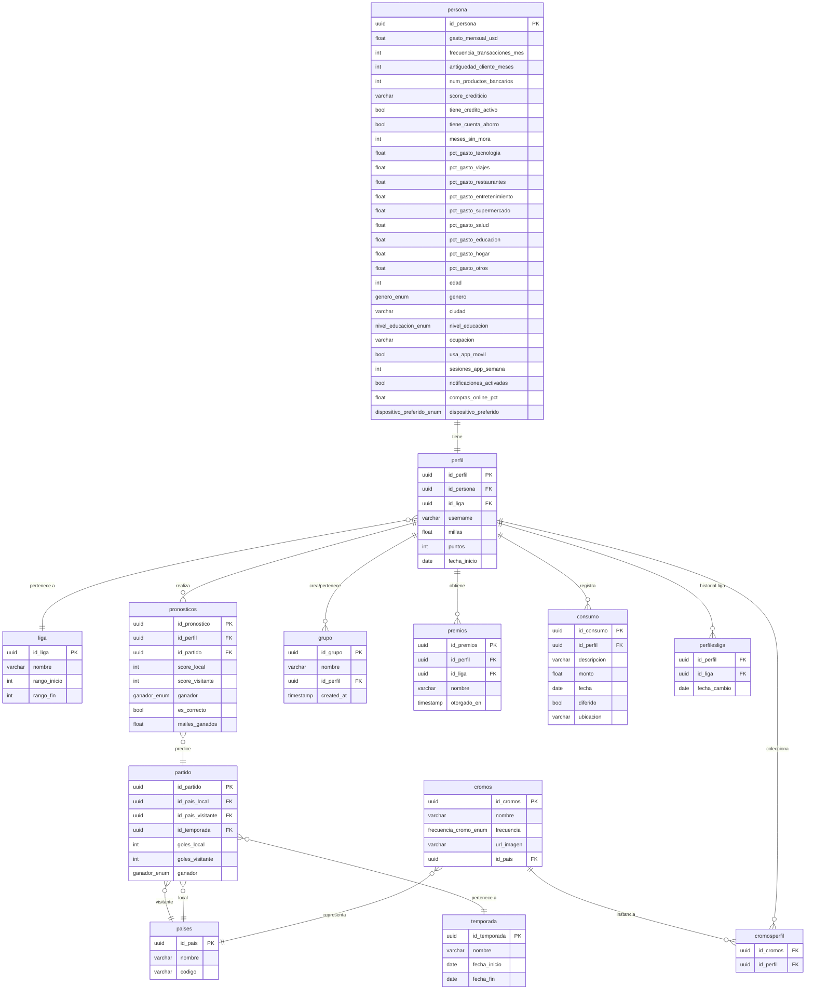

```mermaid
erDiagram
    persona {
        uuid id_persona PK
        float gasto_mensual_usd
        int frecuencia_transacciones_mes
        int antiguedad_cliente_meses
        int num_productos_bancarios
        varchar score_crediticio
        bool tiene_credito_activo
        bool tiene_cuenta_ahorro
        int meses_sin_mora
        float pct_gasto_tecnologia
        float pct_gasto_viajes
        float pct_gasto_restaurantes
        float pct_gasto_entretenimiento
        float pct_gasto_supermercado
        float pct_gasto_salud
        float pct_gasto_educacion
        float pct_gasto_hogar
        float pct_gasto_otros
        int edad
        genero_enum genero
        varchar ciudad
        nivel_educacion_enum nivel_educacion
        varchar ocupacion
        bool usa_app_movil
        int sesiones_app_semana
        bool notificaciones_activadas
        float compras_online_pct
        dispositivo_preferido_enum dispositivo_preferido
    }

    perfil {
        uuid id_perfil PK
        uuid id_persona FK
        uuid id_liga FK
        varchar username
        float millas
        int puntos
        date fecha_inicio
    }

    liga {
        uuid id_liga PK
        varchar nombre
        int rango_inicio
        int rango_fin
    }

    partido {
        uuid id_partido PK
        uuid id_pais_local FK
        uuid id_pais_visitante FK
        uuid id_temporada FK
        int goles_local
        int goles_visitante
        ganador_enum ganador
    }

    pronosticos {
        uuid id_pronostico PK
        uuid id_perfil FK
        uuid id_partido FK
        int score_local
        int score_visitante
        ganador_enum ganador
        bool es_correcto
        float mailes_ganados
    }

    cromos {
        uuid id_cromos PK
        varchar nombre
        frecuencia_cromo_enum frecuencia
        varchar url_imagen
        uuid id_pais FK
    }

    cromosperfil {
        uuid id_cromos FK
        uuid id_perfil FK
    }

    grupo {
        uuid id_grupo PK
        varchar nombre
        uuid id_perfil FK
        timestamp created_at
    }

    premios {
        uuid id_premios PK
        uuid id_perfil FK
        uuid id_liga FK
        varchar nombre
        timestamp otorgado_en
    }

    consumo {
        uuid id_consumo PK
        uuid id_perfil FK
        varchar descripcion
        float monto
        date fecha
        bool diferido
        varchar ubicacion
    }

    temporada {
        uuid id_temporada PK
        varchar nombre
        date fecha_inicio
        date fecha_fin
    }

    paises {
        uuid id_pais PK
        varchar nombre
        varchar codigo
    }

    perfilesliga {
        uuid id_perfil FK
        uuid id_liga FK
        date fecha_cambio
    }

    persona ||--|| perfil : "tiene"
    perfil }o--|| liga : "pertenece a"
    perfil ||--o{ pronosticos : "realiza"
    perfil ||--o{ consumo : "registra"
    perfil ||--o{ grupo : "crea/pertenece"
    perfil ||--o{ premios : "obtiene"
    perfil ||--o{ cromosperfil : "colecciona"
    perfil ||--o{ perfilesliga : "historial liga"
    cromos ||--o{ cromosperfil : "instancia"
    cromos }o--|| paises : "representa"
    partido }o--|| paises : "local"
    partido }o--|| paises : "visitante"
    partido }o--|| temporada : "pertenece a"
    pronosticos }o--|| partido : "predice"
```
