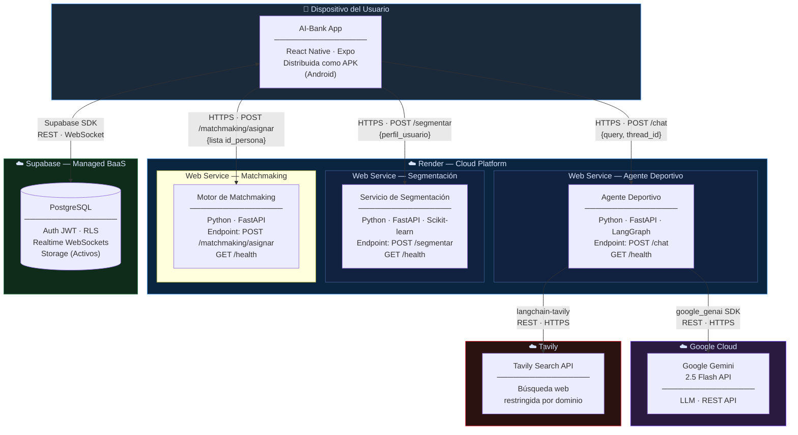

```mermaid
graph TB
    subgraph DEVICE["📱 Dispositivo del Usuario"]
        APK["AI-Bank App\n─────────────────\nReact Native · Expo\nDistribuida como APK\n(Android)"]
    end

    subgraph RENDER["☁️ Render — Cloud Platform"]
        subgraph WS1["Web Service — Agente Deportivo"]
            AGENT["Agente Deportivo\n─────────────────\nPython · FastAPI · LangGraph\nEndpoint: POST /chat\nGET /health"]
        end
        subgraph WS2["Web Service — Segmentación"]
            SEG["Servicio de Segmentación\n─────────────────\nPython · FastAPI · Scikit-learn\nEndpoint: POST /segmentar\nGET /health"]
        end
        subgraph WS3["Web Service — Matchmaking"]
            MATCH["Motor de Matchmaking\n─────────────────\nPython · FastAPI\nEndpoint: POST /matchmaking/asignar\nGET /health"]
        end
    end

    subgraph SUPABASE["☁️ Supabase — Managed BaaS"]
        DB[("PostgreSQL\n─────────────────\nAuth JWT · RLS\nRealtime WebSockets\nStorage (Activos)")]
    end

    subgraph GOOGLE["☁️ Google Cloud"]
        GEMINI["Google Gemini\n2.5 Flash API\n─────────────────\nLLM · REST API"]
    end

    subgraph TAVILY_CLOUD["☁️ Tavily"]
        TAVILY["Tavily Search API\n─────────────────\nBúsqueda web\nrestringida por dominio"]
    end

    APK -- "HTTPS · POST /chat\n{query, thread_id}" --> AGENT
    APK -- "HTTPS · POST /segmentar\n{perfil_usuario}" --> SEG
    APK -- "HTTPS · POST /matchmaking/asignar\n{lista id_persona}" --> MATCH
    APK <-- "Supabase SDK\nREST · WebSocket" --> DB

    AGENT -- "google_genai SDK\nREST · HTTPS" --> GEMINI
    AGENT -- "langchain-tavily\nREST · HTTPS" --> TAVILY

    style DEVICE   fill:#1a2a3a,color:#d7e3fc,stroke:#4d9ef7
    style RENDER   fill:#0a2540,color:#d7e3fc,stroke:#4d9ef7
    style WS1      fill:#112240,color:#d7e3fc,stroke:#3a5a8a
    style WS2      fill:#112240,color:#d7e3fc,stroke:#3a5a8a
    style SUPABASE fill:#0f2c1a,color:#d7e3fc,stroke:#2e7d52
    style GOOGLE   fill:#2a1a40,color:#d7e3fc,stroke:#7c4dff
    style TAVILY_CLOUD fill:#2a1210,color:#d7e3fc,stroke:#e6192e
```
