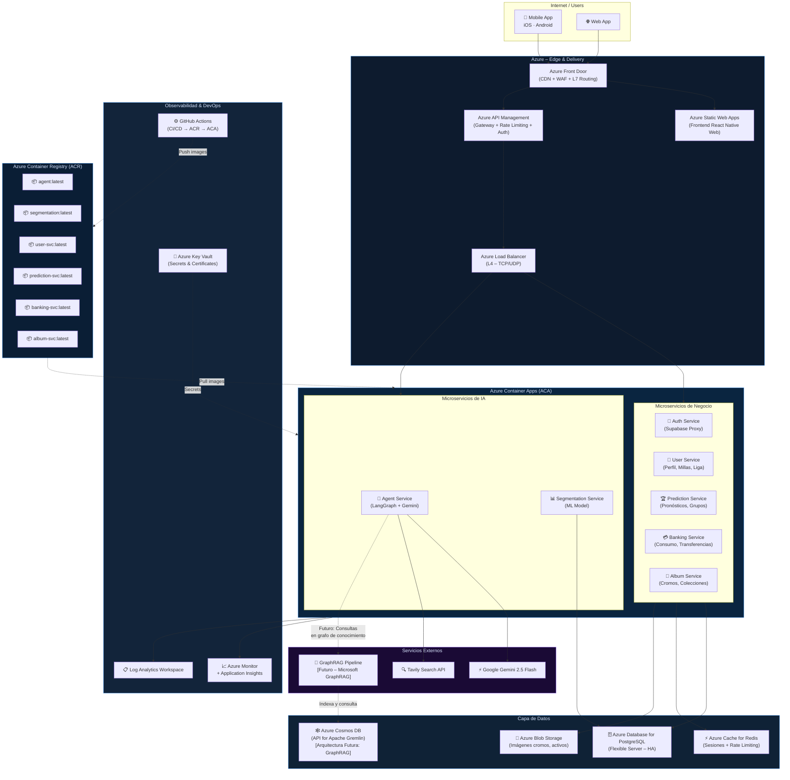

```mermaid
graph TB
    subgraph INTERNET["Internet / Users"]
        MOBILE["📱 Mobile App\niOS · Android"]
        WEB["🌐 Web App"]
    end

    subgraph AZURE_EDGE["Azure – Edge & Delivery"]
        SWA["Azure Static Web Apps\n(Frontend React Native Web)"]
        APIM["Azure API Management\n(Gateway + Rate Limiting + Auth)"]
        LB["Azure Load Balancer\n(L4 – TCP/UDP)"]
        FD["Azure Front Door\n(CDN + WAF + L7 Routing)"]
    end

    subgraph AZURE_ACA["Azure Container Apps (ACA)"]
        direction TB
        subgraph BIZ["Microservicios de Negocio"]
            AUTH_SVC["🔐 Auth Service\n(Supabase Proxy)"]
            USER_SVC["👤 User Service\n(Perfil, Millas, Liga)"]
            PRED_SVC["🏆 Prediction Service\n(Pronósticos, Grupos)"]
            BANK_SVC["💳 Banking Service\n(Consumo, Transferencias)"]
            ALBUM_SVC["🎴 Album Service\n(Cromos, Colecciones)"]
        end
        subgraph AI_SVC["Microservicios de IA"]
            AGENT_SVC["🤖 Agent Service\n(LangGraph + Gemini)"]
            SEG_SVC["📊 Segmentation Service\n(ML Model)"]
        end
    end

    subgraph ACR["Azure Container Registry (ACR)"]
        IMG1["📦 agent:latest"]
        IMG2["📦 segmentation:latest"]
        IMG3["📦 user-svc:latest"]
        IMG4["📦 prediction-svc:latest"]
        IMG5["📦 banking-svc:latest"]
        IMG6["📦 album-svc:latest"]
    end

    subgraph DATA_LAYER["Capa de Datos"]
        PSQL["🗄️ Azure Database for PostgreSQL\n(Flexible Server – HA)"]
        GRAPHDB["🕸️ Azure Cosmos DB\n(API for Apache Gremlin)\n[Arquitectura Futura: GraphRAG]"]
        CACHE["⚡ Azure Cache for Redis\n(Sesiones + Rate Limiting)"]
        BLOB["📁 Azure Blob Storage\n(Imágenes cromos, activos)"]
    end

    subgraph EXTERNAL["Servicios Externos"]
        GEMINI_EXT["⚡ Google Gemini 2.5 Flash"]
        TAVILY_EXT["🔍 Tavily Search API"]
        GRAPHRAG_EXT["🔗 GraphRAG Pipeline\n[Futuro – Microsoft GraphRAG]"]
    end

    subgraph OPS["Observabilidad & DevOps"]
        MONITOR["📈 Azure Monitor\n+ Application Insights"]
        LOGS["📋 Log Analytics Workspace"]
        KV["🔑 Azure Key Vault\n(Secrets & Certificates)"]
        CICD["⚙️ GitHub Actions\n(CI/CD → ACR → ACA)"]
    end

    MOBILE & WEB --> FD
    FD --> SWA
    FD --> APIM
    APIM --> LB
    LB --> BIZ
    LB --> AI_SVC

    AGENT_SVC --> GEMINI_EXT & TAVILY_EXT
    AGENT_SVC -. "Futuro: Consultas\nen grafo de conocimiento" .-> GRAPHRAG_EXT
    GRAPHRAG_EXT -. "Indexa y consulta" .-> GRAPHDB

    BIZ --> PSQL & CACHE & BLOB
    SEG_SVC --> PSQL

    ACR -. "Pull images" .-> AZURE_ACA
    CICD -. "Push images" .-> ACR

    AZURE_ACA --> MONITOR & LOGS
    KV -. "Secrets" .-> AZURE_ACA

    style AZURE_ACA fill:#0a2540,color:#d7e3fc,stroke:#4d9ef7
    style ACR fill:#0a1e35,color:#d7e3fc,stroke:#4d9ef7
    style DATA_LAYER fill:#0f2236,color:#d7e3fc,stroke:#4d9ef7
    style AZURE_EDGE fill:#0d1b2e,color:#d7e3fc,stroke:#4d9ef7
    style OPS fill:#12243a,color:#d7e3fc,stroke:#4d9ef7
    style EXTERNAL fill:#1a0a35,color:#d7e3fc,stroke:#9b6fff
```
