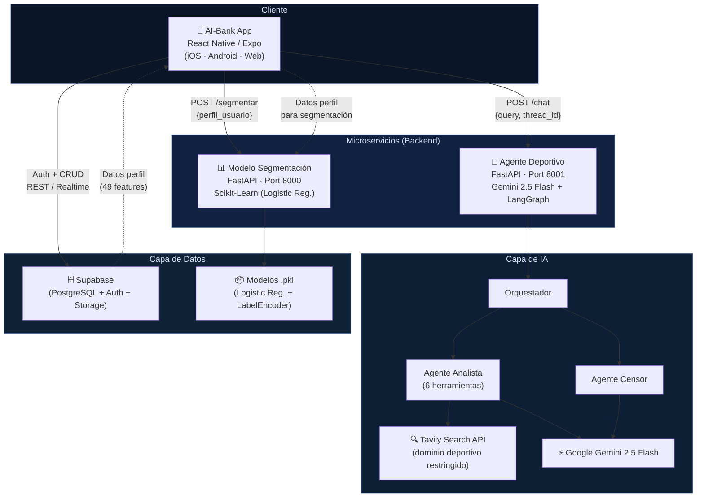

```mermaid
graph TB
    subgraph CLIENT["Cliente"]
        APP["📱 AI-Bank App\nReact Native / Expo\n(iOS · Android · Web)"]
    end

    subgraph BACKENDS["Microservicios (Backend)"]
        AGENT["🤖 Agente Deportivo\nFastAPI · Port 8001\nGemini 2.5 Flash + LangGraph"]
        SEG["📊 Modelo Segmentación\nFastAPI · Port 8000\nScikit-Learn (Logistic Reg.)"]
    end

    subgraph AI["Capa de IA"]
        ORCH["Orquestador"]
        ANAL["Agente Analista\n(6 herramientas)"]
        CENS["Agente Censor"]
        TAVILY["🔍 Tavily Search API\n(dominio deportivo restringido)"]
        GEMINI["⚡ Google Gemini 2.5 Flash"]
    end

    subgraph DATA["Capa de Datos"]
        SUPA["🗄️ Supabase\n(PostgreSQL + Auth + Storage)"]
        PKL["📦 Modelos .pkl\n(Logistic Reg. + LabelEncoder)"]
    end

    APP -- "POST /chat\n{query, thread_id}" --> AGENT
    APP -- "POST /segmentar\n{perfil_usuario}" --> SEG
    APP -- "Auth + CRUD\nREST / Realtime" --> SUPA

    AGENT --> ORCH --> ANAL
    ANAL --> TAVILY
    ORCH --> CENS
    ANAL & CENS --> GEMINI

    SEG --> PKL

    SUPA -. "Datos perfil\n(49 features)" .-> APP
    APP -. "Datos perfil\npara segmentación" .-> SEG

    style CLIENT fill:#0a1628,color:#d7e3fc,stroke:#b2c5ff
    style BACKENDS fill:#112240,color:#d7e3fc,stroke:#3a5a8a
    style AI fill:#0d1f35,color:#d7e3fc,stroke:#3a5a8a
    style DATA fill:#0f2236,color:#d7e3fc,stroke:#3a5a8a
```
