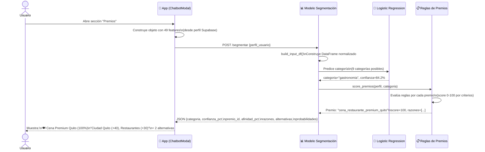

```mermaid
sequenceDiagram
    actor User as Usuario
    participant App as 📱 App (ChatbotModal)
    participant Seg as 📊 Modelo Segmentación
    participant ML as 🧠 Logistic Regression
    participant Rules as 📋 Reglas de Premios

    User->>App: Abre sección "Premios"
    App->>App: Construye objeto con 49 features\n(desde perfil Supabase)

    App->>Seg: POST /segmentar {perfil_usuario}

    Seg->>Seg: build_input_df()\nConstruye DataFrame normalizado

    Seg->>ML: Predice categoría\n(9 categorías posibles)
    ML-->>Seg: categoria="gastronomia", confianza=84.2%

    Seg->>Rules: score_premios(perfil, categoria)
    Rules->>Rules: Evalúa reglas por cada premio\n(score 0-100 por criterios)
    Rules-->>Seg: Premio: "cena_restaurante_premium_quito"\nscore=100, razones=[...]

    Seg-->>App: JSON {categoria, confianza_pct,\npremio_id, afinidad_pct,\nrazones, alternativas,\nprobabilidades}

    App-->>User: Muestra:\n🍽️ Cena Premium Quito (100%)\n"Ciudad Quito (+40), Restaurantes (+30)"\n+ 2 alternativas
```
